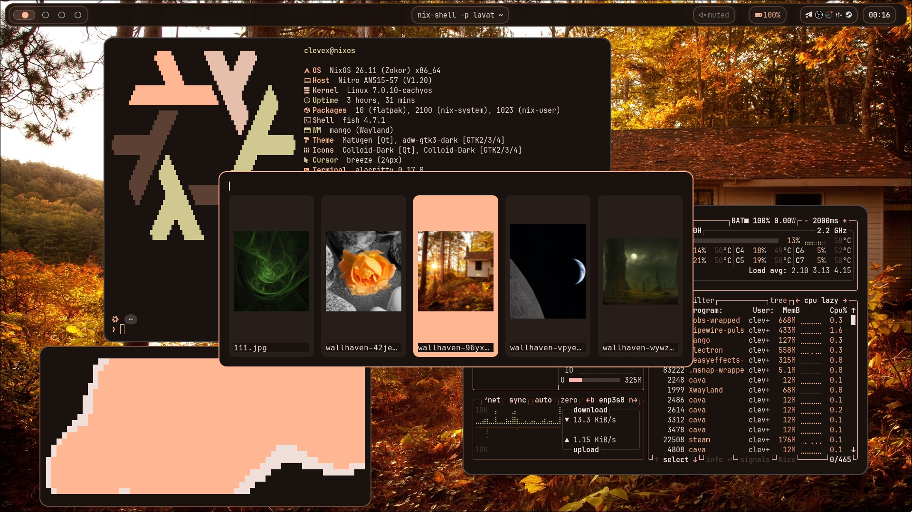

# Installation

```bash
git clone https://github.com/herodnm2/nixos-dotfiles.git
cd nixos-dotfiles
```

Copy NixOS configuration:

```bash
sudo cp -r * /etc/nixos/
sudo nixos-rebuild switch --flake /etc/nixos
```

Copy user configs:

```bash
cp -r .config/* ~/.config/
cp -r wallpapers ~
cp -r wallpaper.sh ~
```
> Replace hardware-configuration.nix with your own before rebuilding.
